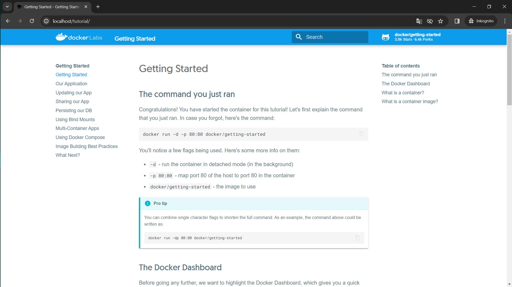

# KN01

## A

## B
### 1
docker -v

### 4

### 5

Ein automatisch generierter Container wurde gestarted. Der Name des Containers wurde zufaellig generiert. Die neuste Version des Ubuntu-Images wurde verwendet.

Ein automatisch generierter Container wurde gestarted. Der Name ist auch zufaelllig generiert. Mit dem Flag -it wurde die interactive terminal direkt aufgemacht.

### 6

### 7

### 8

### 9

### 10

## C

## D

docker pull nginx
docker tag nginx:latest masa07/m347:nginx
docker push masa07/m347:nginx
docker pull mariadb
docker tag mariadb:latest masa07/m347:mariadb
docker push masa07/m347:mariadb
