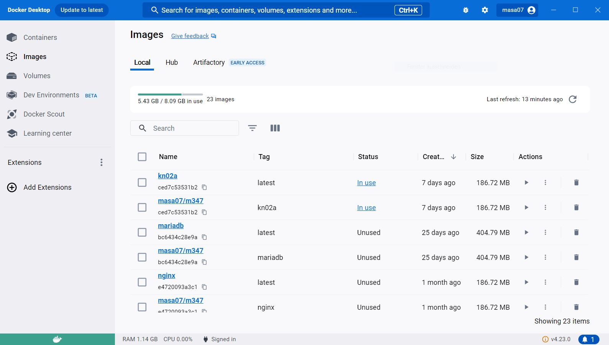

# A

## Dockerfile
```
# nutzt die offizielle nginx als basis
FROM nginx

# directory setzen
WORKDIR /usr/share/nginx/html

# copiert helloworld.html ins standardspeicherort fuer html-dateien in nginx
COPY helloworld.html .

# ermoeglicht das abhoeren der requests durch port 80
EXPOSE 80
```

## commands
```
docker build -t kn02a
docker tag kn02a masa07/m347:kn02a
docker push masa07/m347:kn02a
docker run -d -p 8080:80 --name kn02 kn02a
```



# B

## telnet befehl


## Dockerfile-db
```
FROM mariadb

ENV MYSQL_ROOT_PASSWORD 1234

EXPOSE 3306
```


## Dockerfile-web
```
FROM php:8.0-apache

COPY *.php /var/www/html/

RUN docker-php-ext-install mysqli

EXPOSE 80

```

## commands 
```
docker build -t kn02b-db -f Dockerfile-db .
docker run -d --name kn02b-db -p 3306:3306 kn02b-db
docker build -t kn02b-web -f Dockerfile-web .
docker run -d --name kn02b-web -p 8080:80 --link kn02b-db kn02b-web
```
## db.php
```
<?php
      $servername = "kn02b-db";
      $username = "root";
      $password = "example";
      //$dbname = "mysql";
      // Create connection
      $conn = new mysqli($servername, $username, $password);
      // Check connection
      if ($conn->connect_error) {
        die("Connection failed: " . $conn->connect_error);
      }
      $sql = "SELECT Host, User FROM mysql.user;";
      $result = $conn->query($sql);
      while ($row = $result->fetch_assoc()) {
        echo ($row["Host"] . " / " . $row["User"] . "<br />");
      }
?>
```

## info.php
```
<?php
    phpinfo();
?>
```
