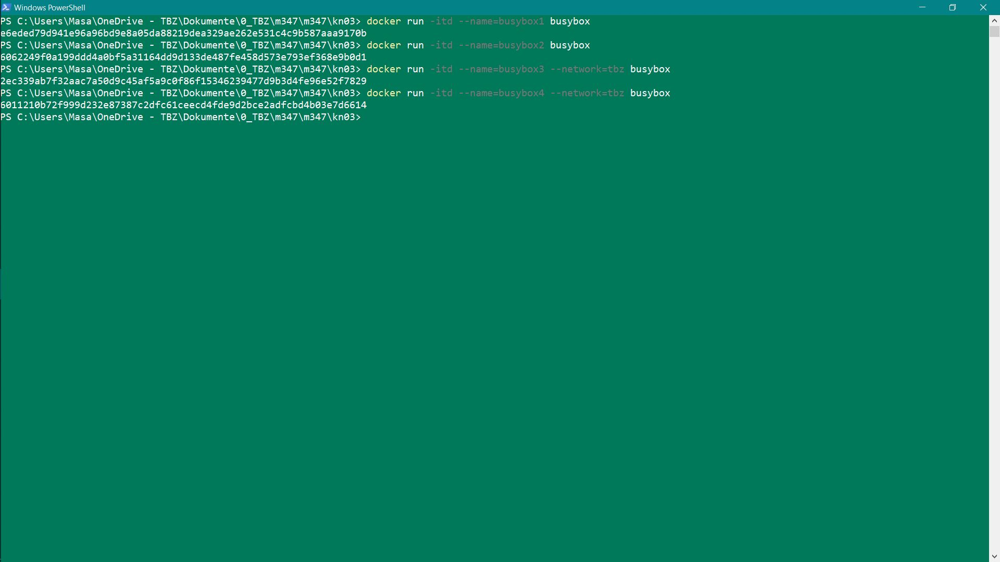
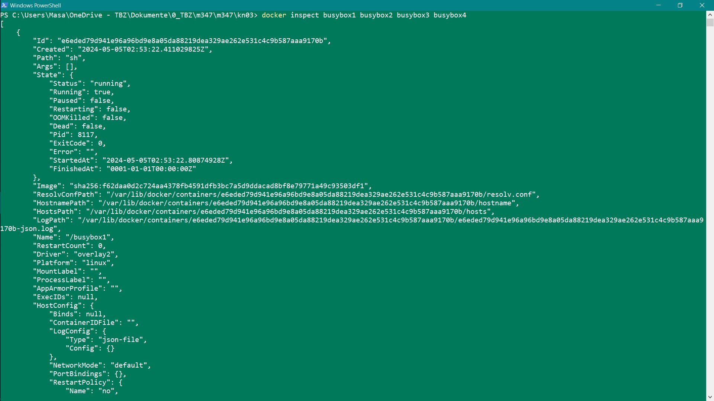

```

docker network create -d bridge tbz
docker network ls
docker pull busybox:latest
docker run -itd --name=busybox1 busybox
docker run -itd --name=busybox2 busybox
docker run -itd --name=busybox3 --network=tbz busybox
docker run -itd --name=busybox4 --network=tbz busybox

```

# IP-Adressen

busybox1: 172.17.0.2
busybox2: 172.17.0.3
busybox3: 172.19.0.2
busybox4: 172.19.0.3

# Screenshots

## Erstellen




## Docker Inspect



## Busybox1 ping


## Busybox3 ping


Die Container in KN02 sind mit --link verbunden und koennen miteinander reden. 

Busybox1 kann Busybox2 aber nicht Busybox3 pingen, weil Busybox1 und Busybox2 mit dem Standardnetzwerk bridge verbunden sind, waehrend Busybox3 und Busybox4 mit dem Customnetzwerk tbz verbunden sind. Das ist auch der Grund warum sie einander pingen koennen. Container im Customnetzwerk koennen auch ueber ihren namen miteinander kommunizieren.
