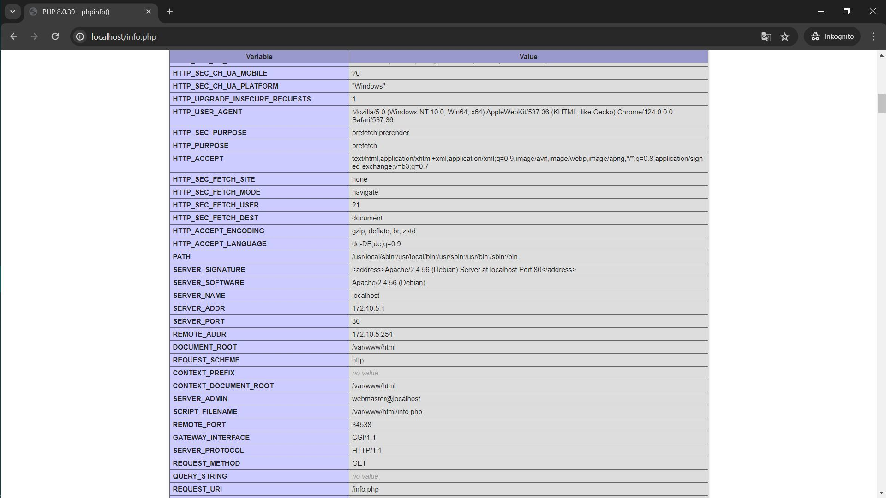
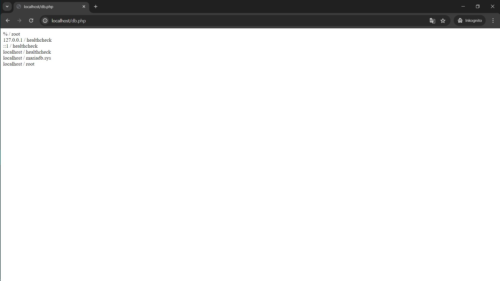
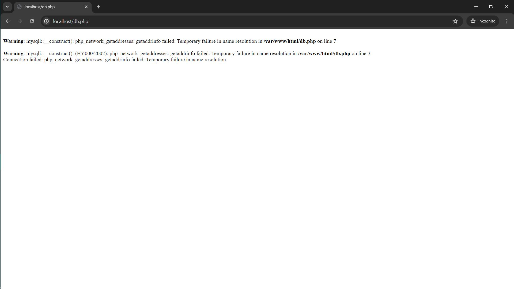
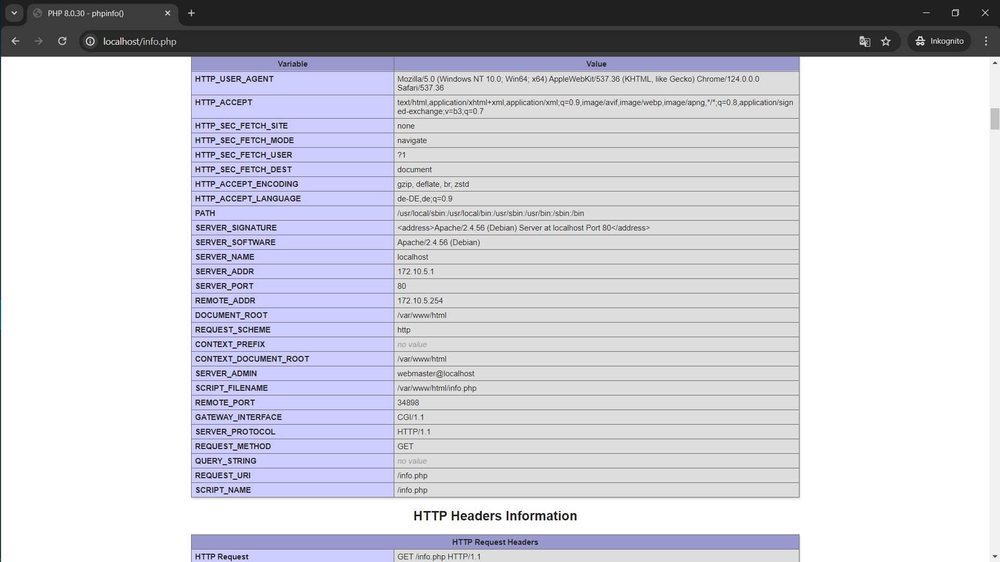

# docker-compose.yaml
```
version: '3.8'

networks:
  m347-network:
    ipam:
      driver: default
      config:
        - subnet: 172.20.0.0/16
          ip_range: 172.20.5.0/24
          gateway: 172.20.5.254

services:
  m347-kn04a-db:
    image: mariadb:latest
    container_name: m347-kn04a-db
    environment:
      - MYSQL_ROOT_PASSWORD=yes
    networks:
      - m347-network
    ports:
      - "3306:3306"

  m347-kn04a-web:
    build:
      context: .
      dockerfile: Dockerfile
    container_name: m347-kn04a-web
    ports:
      - "80:80"
    networks:
      - m347-network

```

# Dockerfile
```
FROM php:8.0-apache
WORKDIR /var/www/html/
COPY src .
EXPOSE 80
RUN ["docker-php-ext-install", "mysqli"]
```

docker compose up umfasst
docker build --> image erstellen
docker create --> container erstellen
docker start --> container starten




# docker-compose.yaml
```
version: '3.8'

networks:
  m347-network:
    ipam:
      driver: default
      config:
        - subnet: 172.20.0.0/16
          ip_range: 172.20.5.0/24
          gateway: 172.20.5.254

services:
  m347-kn04a-db:
    image: mariadb:latest
    container_name: m347-kn04a-db
    environment:
      - MYSQL_ROOT_PASSWORD=yes
    networks:
      - m347-network
    ports:
      - "3306:3306"

  m347-kn04a-web:
    image: kn02b-web:latest
    container_name: m347-kn04a-web
    ports:
      - "80:80"
    networks:
      - m347-network

```
Es geht nicht, weil man noch Logindaten vom alten Dockerfile verwendet. Um das Problem zu umgehen kann man "enviroment" variabeln deklarieren und die alte Daten werden ueberschrieben. 

# docker-cloud-init.yaml
```
#cloud-config
# source: https://gist.github.com/syntaqx/9dd3ff11fb3d48b032c84f3e31af9163
users:
  - name: ubuntu
    sudo: ALL=(ALL) NOPASSWD:ALL
    groups: users, admin
    home: /home/ubuntu
    shell: /bin/bash
    ssh_authorized_keys:
      - ssh-rsa AAAAB3NzaC1yc2EAAAADAQABAAABAQCUBo+qnNu5xxM9vfz4C04M36FHxHNrEMdm5TkFj1/SfVtqunlUOeMpu7nFCZZKnX8HYwf/MkjcBiTYAgncxku8grwl6XuW/pcvmb6/ghSIaw4xtRRSzit7omqJ5d8kXB3+Nd1aaMHsjfly4nkaqswhySVXQqr8Hw6DbWVw8jLLVKEE+5NZHY33hJkhJwK4blCllsGpmQaKi1qxjsN0hZOWNK01iJAydwD8t2xJ0NOYbq8Qas5IyPnRN7SPxvEhIP6WLQ6Ym6Dmf8FwNW1cHLTKabgjzt5f/HKUkKS89dPd3fn4nnFli1BOMECGUIvVlOw2pQNri7+04OOfn2FGlqr5 teacher
      - ssh-rsa AAAAB3NzaC1yc2EAAAADAQABAAACAQDBrTWbP1meq6NZ6eOfQOvJ4UwZlPFh0a40xDauB1M2REtk25+MRbBO+tMYE2Vz5uZwM4tkVzgvSTuoV0VbBFyHfyTZXdXG+F/8fxnBJYehhlEZILpcc+8f3/1yyRnxix6c3t25qWGX+j0NU9UDVLK6dQfwg/GXIYV/GL5hTzHAxhtVD/kSZEFpgXveOYGGvv4XE+t5OtTXVouqcU48WQyq3UlSlN629Uf/lPwDpIKN8JCYUQFcVunMN43WwvByLq7XGSFviBcuaZJPdizqI8PtzVWzIGLY4CrwNoiQdmg/4BaJh3XPgW6G2fgJ64gfpQ2hp2HBsKdiex+X2J70IfB3nK6CsY5/siP/pxIofiG2v+4oAuADx4yWa0/AVLntMueOqq+tJ0jfSf2+eYfPNZvraTlzPfSvY0PGbI6RadobROP9A1uMvbSLWB/ofsVymbO5tz1AKOT0zbAeoVRvXf//R0MJe9isMpuCQkvq/p0FQoFS/8cO2DPI3Gm718/eBfkR2ZWYuDysZiOQftr5qIlpF9qbIjMZcWhGB/23KCEIOHzilvP6PnIWJ0V1Xz6+zadOz0s53z8zKK3icryA2+8kPF6qMVqu+s4eIvtaDPkkjjQtNJ+CKwPgy6/jrmgkoVnSLZFM+sJp4856sxJIgOhQgI+rUg6e6TiBJSTAWkpinw== loyes.luise@gmail.com

ssh_pwauth: false
disable_root: false
package_update: true
package_upgrade: true
groups:
  - docker
system_info:
  default_user:
    groups: [docker]
packages:
  - apt-transport-https
  - ca-certificates
  - curl
  - gnupg
  - lsb-release
  - unattended-upgrades
final_message: "The system is finally up, after $UPTIME seconds"
write_files: # Erweitern Sie diesen Teil
runcmd:
  - mkdir -p /etc/apt/keyrings
  - curl -fsSL https://download.docker.com/linux/ubuntu/gpg | gpg --dearmor -o /etc/apt/keyrings/docker.gpg
  - echo "deb [arch=$(dpkg --print-architecture) signed-by=/etc/apt/keyrings/docker.gpg] https://download.docker.com/linux/ubuntu $(lsb_release -cs) stable" | tee /etc/apt/sources.list.d/docker.list > /dev/null
  - apt-get update
  - apt-get install -y docker-ce docker-ce-cli containerd.io docker-compose-plugin
  - systemctl enable docker
  - systemctl start docker
  # Erwetiern Sie hier die Befehle!


```
