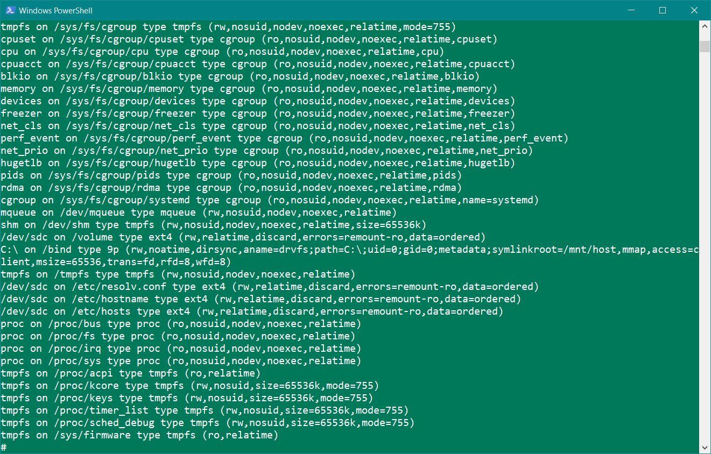
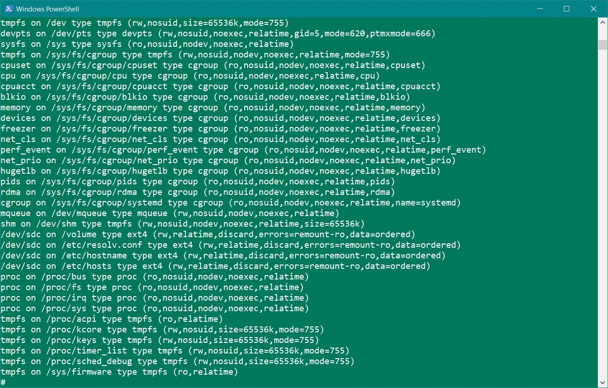

## (aus irgendeinem Grund laufen shell scripts nicht)

```
docker run -d --name kn05 -v /c/kn05:/usr/kn05 nginx:latest
```


Ich kann hier beweisen, dass man files, die ich local erstelle, auch im container lesen kann.

# B

```
docker volume create kn05volume

docker run -d --name kn05f -v kn05volume:/data nginx:latest

docker run -d --name kn05g -v kn05volume:/data nginx:latest

docker exec -it kn05f sh

echo "RHeinmetall" >> /data/rhein.txt

docker exec -it kn05g sh

cat /data/rhein.txt
```


# C

```
version: '3.8'

volumes:
  rheinmetall:
  tmpfs:

services:
  kn05c1:
    image: nginx:latest
    volumes:
      - type: volume
        source: rheinmetall
        target: /volume
      - type: bind
        source: /c/kn05
        target: /bind
      - type: tmpfs
        target: /tmpfs

  kn05c2:
    image: nginx:latest
    volumes:
      - rheinmetall:/volume
```

## Auszug aus dem 1. Container



## Auszug aus dem 2. Container


